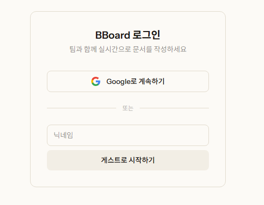
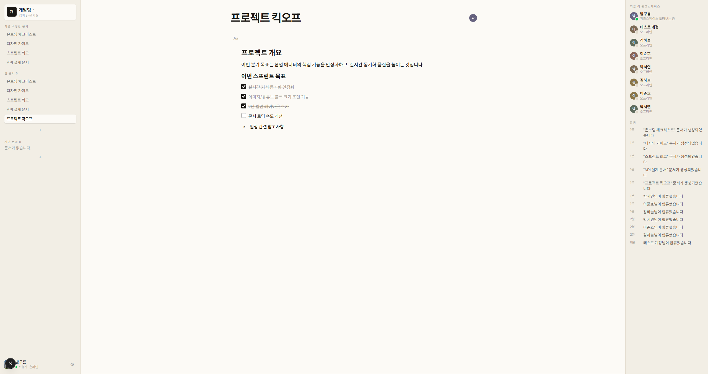
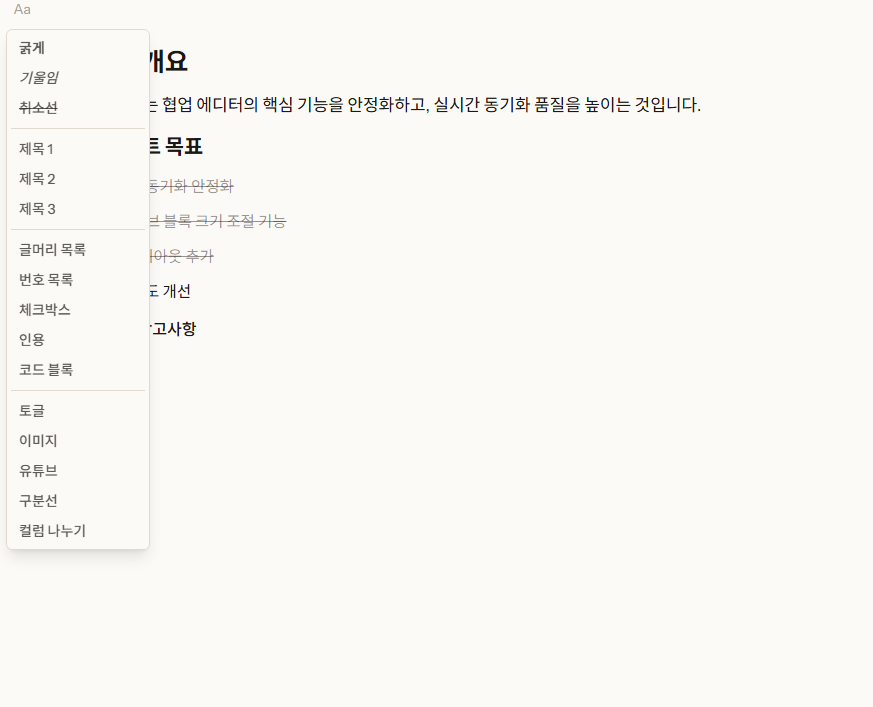
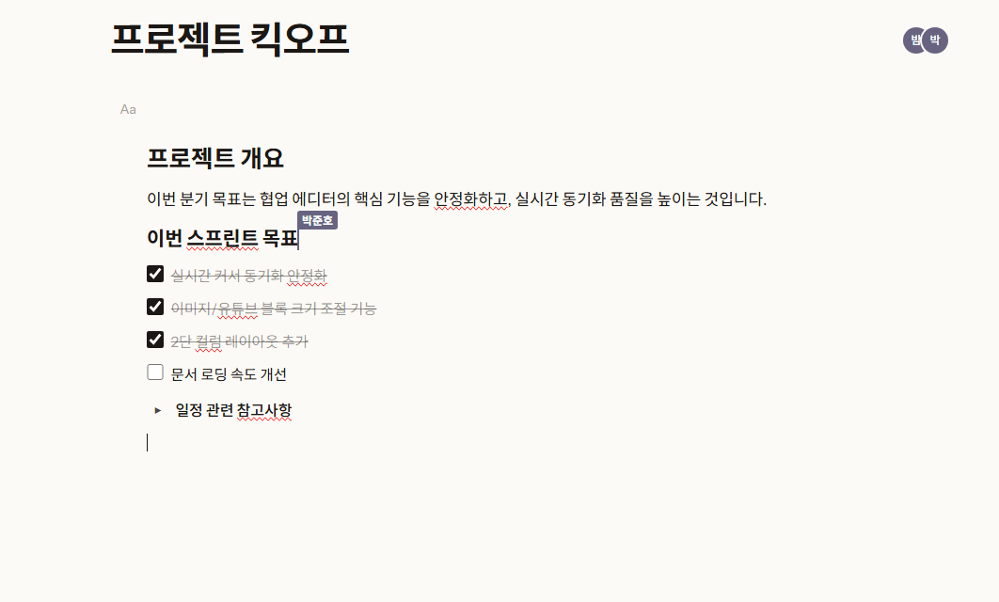
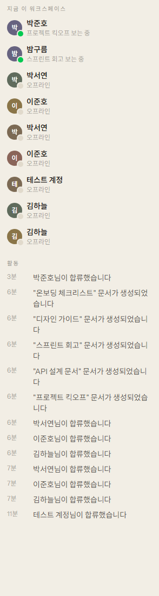

# BBoard

여러 명이 동시에 같은 문서를 실시간으로 편집할 수 있는 협업 워크스페이스 툴입니다. 워크스페이스 단위로 문서를 모아 관리하고, 리치 텍스트 에디터에서 이미지·유튜브·컬럼 레이아웃 같은 다양한 서식으로 문서를 작성할 수 있습니다.

**🔗 배포 사이트: [bboard-one.vercel.app](https://bboard-one.vercel.app/)**
게스트 로그인 가능 — 별도 가입 없이 닉네임만 입력하면 바로 체험해볼 수 있습니다.



## 아키텍처


Next.js 앱이 문서 메타데이터·권한·활동 기록 등은 Supabase에서 직접 다루고, 문서 **본문 내용의 실시간 협업 편집**만 별도로 배포되는 Cloudflare Worker(`workers/sync`)가 Durable Object 하나당 문서 하나씩 담당해 Yjs 문서 상태를 유지·동기화합니다. 이 워커가 주기적으로 Yjs 상태 스냅샷을 Supabase의 `documents.yjs_state` 컬럼에 저장하기 때문에, 워커가 재시작되어도 내용이 유지됩니다.

## 스크린샷


사이드바(즐겨찾기/최근 문서/팀 문서/개인 문서) + 문서 에디터 + 활동 사이드바가 함께 보이는 전체 화면


제목·목록·체크박스·토글·이미지·유튜브·구분선·컬럼 등 다양한 서식


다른 사용자의 커서가 실시간으로 표시됨


멤버 온라인 상태 & 활동 기록

## 주요 기능

### 워크스페이스 & 문서
- **개인 워크스페이스** / **팀 워크스페이스** 두 종류를 만들 수 있고, 종류에 따라 문서 공유 범위와 멤버 권한 체계가 다르게 동작합니다.
- 팀 워크스페이스는 **팀 문서**와 **개인 문서**(작성자와 초대받은 사람만 접근)로 나뉘고, 왼쪽 사이드바에서 **즐겨찾기 / 최근 수정한 문서 / 팀 문서 / 개인 문서**로 분류되어 보입니다.
- 워크스페이스 멤버는 **소유자(owner) / 편집(editor) / 보기(guest)** 권한으로 구분되며, 초대 링크를 통해 워크스페이스 단위 또는 문서 단위로 초대할 수 있습니다.

### 실시간 협업 에디터
- [Yjs](https://github.com/yjs/yjs) 기반 CRDT로 여러 명이 동시에 같은 문서를 편집해도 충돌 없이 병합됩니다.
- 다른 사용자의 커서와 색상이 실시간으로 보이고, 지금 이 문서를 보고 있는 사람 목록도 함께 표시됩니다.
- 브라우저 IndexedDB에 문서를 로컬 캐싱해서, 이미 열어본 문서는 네트워크 동기화를 기다리지 않고 즉시 렌더링되고 최신 변경분은 백그라운드에서 자동으로 합쳐집니다.

### 리치 텍스트 서식
- 제목, 목록(글머리/번호/체크박스), 인용, 코드 블록, 구분선
- **토글(접기/펼치기) 블록** — 열고 닫을 때 부드러운 애니메이션
- **이미지** — 드래그 앤 드롭 업로드, 모서리 드래그로 크기 조절(비율 유지, 문서 폭 기준 초기/최대 크기)
- **유튜브 임베드** — 링크만 붙여넣으면 자동 임베드, 가장자리 클릭으로 선택/삭제, 가운데 클릭으로 바로 재생
- **2단 컬럼 레이아웃**
- 이미지/유튜브/구분선/컬럼 모두 클릭해서 선택 후 `Delete`로 삭제 가능
- 드래그 핸들로 블록 순서 변경, 문서 폭은 직접 드래그로 조절 가능

### 그 외
- 문서/워크스페이스 활동 기록(누가 무엇을 언제 수정했는지) 사이드바
- Google OAuth 로그인
- 프로필 편집(이름, 프로필 사진)이 다른 접속자 화면에도 실시간 반영

## 기술 스택

| 영역 | 사용 기술 |
| --- | --- |
| 프레임워크 | [Next.js](https://nextjs.org) 16 (App Router, Server Components/Actions), React 19, TypeScript |
| 스타일 | Tailwind CSS v4 |
| 에디터 | [TipTap](https://tiptap.dev) v3 (ProseMirror) + [Yjs](https://github.com/yjs/yjs) |
| 실시간 동기화 서버 | Cloudflare Workers + Durable Objects ([y-partyserver](https://github.com/partykit/partykit)) |
| 백엔드 | [Supabase](https://supabase.com) — Postgres, Row Level Security, Auth, Storage, Realtime |

## 시작하기

### 사전 준비

- Node.js
- [Supabase](https://supabase.com) 프로젝트 (Auth, Postgres, Storage, Realtime 사용)
- [Cloudflare](https://developers.cloudflare.com/workers/) 계정 (동기화 서버 배포용, 로컬 개발은 `wrangler dev`로 대체 가능)

### 설치

```bash
npm install
cd workers/sync && npm install
```

### 환경 변수

`.env.local.example`을 `.env.local`로 복사하고 Supabase 프로젝트 설정(Project Settings → API)에서 값을 채웁니다.

```bash
cp .env.local.example .env.local
```

`workers/sync/wrangler.jsonc`에는 `SUPABASE_URL`, `SUPABASE_PUBLISHABLE_KEY`를 설정하고, 아래 명령으로 서비스 롤 키를 시크릿으로 등록합니다(커밋되지 않음).

```bash
cd workers/sync
npx wrangler secret put SUPABASE_SERVICE_ROLE_KEY
```

### 데이터베이스 마이그레이션

`supabase/migrations`의 SQL 파일을 순서대로 Supabase 프로젝트에 적용합니다(Supabase CLI 또는 대시보드의 SQL Editor 사용).

### 개발 서버 실행

두 서버를 각각 띄워야 합니다.

```bash
# 터미널 1 - 동기화 서버 (localhost:8787)
cd workers/sync && npm run dev

# 터미널 2 - Next.js 앱 (localhost:3000)
npm run dev
```

## 프로젝트 구조

```
src/app/
  login/                  로그인
  workspaces/new/         워크스페이스 생성
  workspaces/[id]/        워크스페이스 레이아웃, 사이드바, 초대/멤버 관리
    documents/[docId]/    문서 에디터와 TipTap 확장(이미지·유튜브·컬럼·구분선 등)
  invite/                 워크스페이스/문서 초대 링크 수락
supabase/migrations/      DB 스키마, RLS 정책, 마이그레이션 이력
workers/sync/             Yjs 실시간 동기화용 Cloudflare Worker (Durable Object)
```
